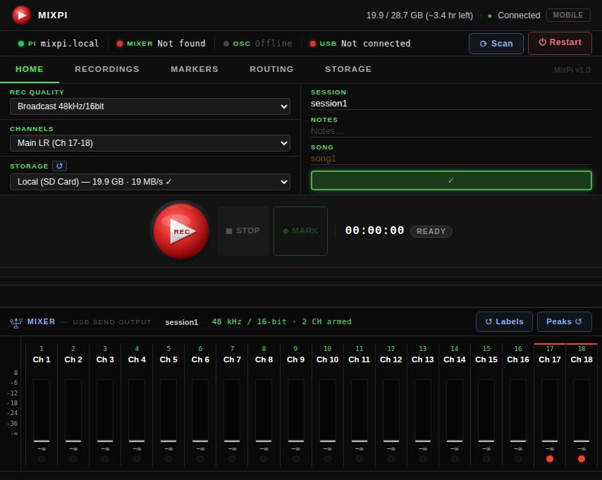
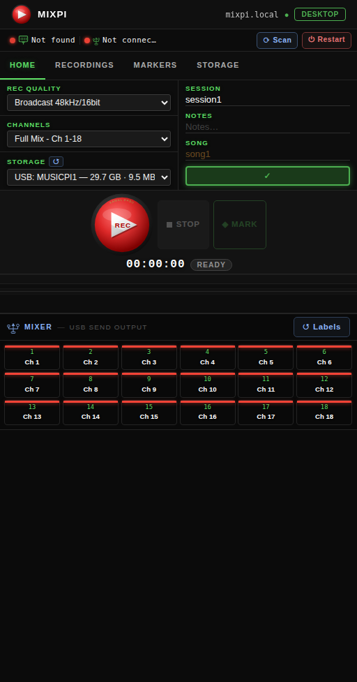
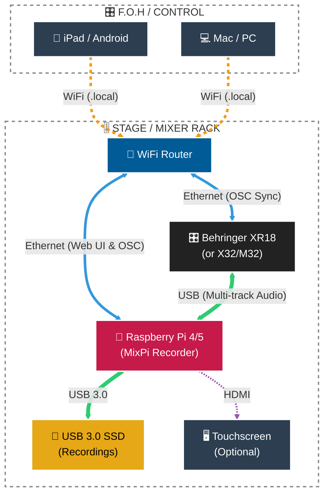

# MixPi — Multi-Track Recorder for Behringer & Midas Digital Mixers

A professional multi-track USB audio recorder that runs on a Raspberry Pi 4/5. It captures every channel from your Behringer X Air, X32, or Midas M32 series mixer (up to 32 channels simultaneously) and provides full session management through a browser-based interface accessible from any device on your network — phone, tablet, laptop, or a touchscreen connected to Raspberry Pi.

> **Note:** MixPi is primarily developed and tested with the **Behringer XR18**. Support for other X Air, X32, and M32 models is provided based on their shared OSC and USB audio architecture.

<div align="center">
  <table>
    <tr>
      <td valign="top"></td>
      <td valign="top"></td>
    </tr>
  </table>
</div>

## System Architecture



## Supported Mixers

MixPi auto-detects the following mixers via USB and OSC:
- **Behringer X Air series:** XR18, X18, XR16, XR12
- **Behringer X32 family:** X32, X32 Compact, X32 Producer, X32 Rack
- **Midas M32 family:** M32, M32R, M32C

### X32 / M32 Series Notes
While MixPi seamlessly records up to 32 channels from the X32/M32 X-USB expansion card, please note:
- **USB Routing:** The "Routing" tab in MixPi is currently optimized for the X Air series (which uses 1-to-1 routing). For X32/M32 mixers, you must configure your Card Out routing (in blocks of 8) using the mixer's built-in screen or the official X32-Edit app.
- **Why use MixPi with an X32?** Out of the box, the X32 only records 2-track stereo to a top-panel USB stick. While Behringer sells an X-LIVE SD card expansion for multi-track recording, MixPi offers a cheaper, more powerful alternative: it records directly to massive USB 3.0 SSDs, provides a beautiful touchscreen-friendly web UI, allows session naming/metadata, and lets you instantly downmix and AirDrop rehearsals straight to your phone.

## Features

### Recording
- **Up to 32-channel simultaneous capture** — all USB audio channels recorded to individual WAV files
- **Selectable quality** — Broadcast 16-bit · Studio 24-bit · Native 32-bit Float (sample rate matches mixer hardware)
- **Pre-roll buffer** — 2-second audio buffer captured before you press Record
- **Session metadata** — Session name, Notes, and Song/Track fields saved with every recording
- **Named folder output** — recordings saved as `{song}_{timestamp}/ch01_Name.wav …` for easy DAW import
- **Timestamped markers** — add named cue points during recording, exported as CSV

### Mixer Integration
- **Auto-discovery** — Scan button finds your mixer on the local network via OSC broadcast; no IP configuration needed
- **Live channel names via OSC** — channel labels and mute states sync automatically from the mixer over your LAN or WiFi network using the OSC protocol
- **Routing panel** — view and adjust USB send routing directly from the web UI
- **Mixer playback** — play back recorded sessions through the mixer's USB return channels

### Storage Management
- **USB drive detection** — automatically lists connected USB drives
- **Format utility** — format drives to exFAT, ext4, or HFS+ directly from the web UI
- **Write-speed benchmark** — verify drive is fast enough before a session
- **Session browser** — browse, download (ZIP), and delete past recordings from the Recordings tab

### Web Interface
- **Responsive desktop view** — full channel strips with VU meters, peak hold, dB readout, EQ badges
- **Mobile view** — compact tile grid, tap-to-arm channels, animated signal indicator; auto-activates on viewports < 768 px
- **Live discovery bar** — shows Pi hostname, mixer firmware/IP, and USB audio device with channel count
- **Real-time level metering** — 50 ms update rate, 2-second peak hold

### Sharing & Export
- **Stereo mix export** — downmix all recorded tracks to a stereo WAV, then export as M4A (AAC 256k), MP3 (320k), or WAV
- **AirDrop / Web Share** — on iOS/iPad, tapping a format opens the native share sheet (AirDrop, Messages, WhatsApp…); on desktop, triggers a file download
- **Local HTTPS** — optional self-signed certificate via `mkcert`; required for AirDrop/Web Share support. By default, MixPi runs on plain HTTP for simpler access. To enable HTTPS, see the [Detailed Setup Guide](#detailed-setup-guide).

## Hardware Requirements

| Item | Spec |
|------|------|
| Raspberry Pi | Pi 4 or Pi 5 (4 GB RAM recommended) |
| Mixer | Behringer X Air, X32, or Midas M32 series |
| Cable | USB-B to USB-A (Pi ↔ mixer) |
| Storage | USB 3.0 SSD or fast flash drive (exFAT recommended) |
| SD card | 16 GB+ for Raspberry Pi OS |
| Network | Gigabit Ethernet (Pi and mixer on same LAN) |

## Software Requirements

- Raspberry Pi OS 64-bit (Bookworm — Debian 12, recommended)
- Python 3.10 or higher
- ALSA audio stack (`alsa-utils`)

## Quick Start — Fresh Raspberry Pi

### Step 1 — Prerequisites

Before installing, ensure you have:
- **Raspberry Pi 4 or 5** with **Raspberry Pi OS 64-bit** (Lite or Desktop) installed.
- **Internet access** (via Ethernet or WiFi) to download packages.
- **SSH enabled** (if installing remotely).
- **A user account** (e.g., `music` or `pi`) with `sudo` privileges.

### Step 2 — One-Command Installation

SSH into your Pi (or open a terminal on the Pi) and run the following command as your **normal user** (not root):

```bash
curl -fsSL https://raw.githubusercontent.com/KamalDasu/mixpi/main/scripts/install-pi.sh | bash
```

This script automates the entire setup:
1.  **System Packages**: Installs `git`, `python3`, `ffmpeg`, `mkcert`, and audio libraries.
2.  **Application**: Clones the repo to `/opt/mixpi` and sets up a Python virtual environment.
3.  **Service**: Installs the `mixpi-recorder` systemd service to auto-start on boot.
4.  **Networking**: Configures a WiFi Access Point (**mixpi-1**) and mDNS (**<hostname>.local**).
5.  **Security**: Optional self-signed HTTPS certificate (disabled by default).
6.  **Optimisation**: Applies system tweaks for low-latency audio.

### Step 3 — Reboot

```bash
sudo reboot
```

### Step 4 — Connect and Trust (One-time per device)

1.  **Join WiFi**: Connect your phone/tablet to the **mixpi-1** network (password: `mixpi123`).
2.  **Open App**: Open Safari/Chrome and go to `http://<hostname>.local:5000`.
3.  **Optional (AirDrop)**: To enable AirDrop/Web Share on iOS, you must enable HTTPS. See [Detailed Setup Guide](#detailed-setup-guide) below.

---

## Detailed Setup Guide

### Step 5 — Enable HTTPS & AirDrop (Optional)

By default, MixPi runs on plain HTTP to avoid browser security warnings and mDNS resolution issues. If you want to use the **AirDrop / Web Share** feature on iOS, you must manually enable HTTPS and install a trusted CA certificate.

#### 1. Enable HTTPS on the Pi
Run the following command on your Raspberry Pi:
```bash
sudo bash /opt/mixpi/scripts/setup_https.sh
```
After the script completes, the MixPi service will automatically restart in HTTPS mode.

#### 2. Install the CA certificate (one-time per device)
The app uses HTTPS so that AirDrop / Web Share works on iOS. Because the certificate is self-signed, each device needs to trust it once. **You only do this once per device — never again.**

##### iPhone / iPad
1. Open **Safari** and go to `http://<hostname>.local:8080`
2. Tap **Install Certificate** — Safari asks *"This website is trying to download a configuration profile"* → tap **Allow**
3. Go to **Settings** → tap **Profile Downloaded** (appears near the top of Settings)
4. Tap **Install** → enter your PIN → tap **Install** again to confirm
5. Go to **Settings → General → About → Certificate Trust Settings**
6. Find *"mkcert development certificate"* → toggle it **on** → tap **Continue**

##### Mac
1. Go to `http://<hostname>.local:8080` in any browser → click **Install Certificate**
2. Double-click the downloaded `mixpi-ca.crt` file → Keychain Access opens
3. Double-click the certificate in Keychain → expand **Trust** → set *"When using this certificate"* to **Always Trust**
4. Close the window → enter your Mac password to save

##### Android / Chrome
1. Go to `http://<hostname>.local:8080` → tap **Install Certificate**
2. Open **Settings → Security → More security settings → Install certificate → CA Certificate**
3. Select the downloaded `mixpi-ca.crt` file

### Step 6 — Open the web UI

```
http://<hostname>.local:5000
```

Or via IP if mDNS isn't resolving: `http://10.10.10.1:5000` (when on the `mixpi-1` WiFi).

**Note:** If you have enabled HTTPS, use: `https://<hostname>.local:5000`. You will see a "Not Secure" warning until you complete the CA certificate trust steps above.

### Step 7 — Connect the Mixer

Plug the mixer into the Pi via USB. The app will automatically detect it as the audio device. To sync channel names from the mixer, tap **Scan** in the discovery bar — the app will find the mixer on the network regardless of its IP address.

---

## Day-to-Day Workflow

### Updating the app

From your workstation:

```bash
# Sync code changes and restart the service
./scripts/sync.sh user@hostname.local
```

Or directly on the Pi to pull the latest release:

```bash
cd /opt/mixpi && git pull && sudo systemctl restart mixpi-recorder
```

### Service management

```bash
sudo systemctl status mixpi-recorder      # check status
sudo systemctl restart mixpi-recorder     # restart
sudo journalctl -u mixpi-recorder -f      # live logs
sudo journalctl -u mixpi-recorder -n 50   # last 50 lines
```

### Editing config

```bash
nano /opt/mixpi/config.yaml
sudo systemctl restart mixpi-recorder
```

---

## Web Interface Overview

MixPi provides a responsive, browser-based interface that adapts to your device. (See [screenshots above](#mixpi--multi-track-recorder-for-behringer--midas-digital-mixers)).

- **Desktop View:** Features full channel strips with high-resolution VU meters, peak hold indicators, dB readouts, and EQ badges. It includes a comprehensive discovery bar, transport controls, and tabbed panels for Recordings, Markers, Routing, and System management (Storage/Reboot).
- **Mobile View:** Automatically activates on smaller screens (under 768px). It presents a compact, touch-friendly grid of channel tiles. Tapping a tile arms the channel, and a red animated bar indicates live signal presence, making it perfect for quick adjustments from a phone on stage.

---

## File Layout

```
recordings/
└── session1_song1_2026-03-25_14-30-00/
    ├── ch01_Kick.wav
    ├── ch02_Snare.wav
    ├── ...
    ├── ch18_MainR.wav
    ├── session.json          # metadata (quality, notes, channel names)
    └── markers.csv           # cue points for DAW import
```

---

## Performance

Measured on Raspberry Pi 4 with USB 3.0 SSD:

| Metric | Value |
|--------|-------|
| CPU usage | 15–25% |
| RAM usage | ~400 MB |
| Write throughput | ~2.1 MB/s (18 ch @ 48 kHz / 16-bit) · ~6.1 MB/s (32 ch @ 48 kHz / 32-bit) |
| Storage per hour | ~7.4 GB (18ch 16-bit) · ~15 GB (18ch 32-bit) · ~22 GB (32ch 32-bit) |

---

## Project Structure

```
mixpi/
├── src/                    # Core engine
│   ├── audio_engine.py     # sounddevice capture, pre-roll, WAV writing
│   ├── storage_manager.py  # session/recording listing and management
│   ├── mixer_detector.py   # USB audio device auto-detection
│   ├── mixer_profiles.py   # XR18 / X Air device profiles
│   ├── level_monitor.py    # RMS/peak metering
│   └── metadata.py         # session.json read/write
├── web/                    # Flask web application
│   ├── app.py              # app factory and startup
│   ├── routes.py           # REST API endpoints
│   ├── websocket.py        # SocketIO level-meter push
│   └── static/
│       ├── index.html
│       ├── css/style.css
│       └── js/
│           ├── app.js       # tab switching, view toggle, discovery bar
│           ├── meters.js    # VU meter rendering and mobile signal animation
│           ├── recorder.js  # transport controls
│           ├── sessions.js  # recordings browser + mixer playback
│           ├── storage.js   # USB drive management
│           └── routing.js   # USB routing panel
├── osc/                    # OSC integration
│   ├── xair_client.py      # XR18 OSC client (channel names, routing)
│   └── osc_server.py       # incoming OSC command listener
├── systemd/                # systemd service unit
├── scripts/
│   ├── install-pi.sh       # Pi-direct one-command installer (use this for fresh Pi)
│   ├── sync.sh             # fast rsync for incremental code pushes
│   ├── setup_ap.sh         # WiFi Access Point setup
│   ├── setup_https.sh      # HTTPS certificate generation (mkcert)
│   ├── setup_pi.sh         # system optimisations
│   └── install-local.sh    # dev machine setup
├── dev/                    # local development helpers
├── docs/
│   └── TOUCHSCREEN_SETUP.md
├── config.yaml             # active config (not committed — Pi-specific)
├── config.yaml.example     # template with all options documented
└── requirements.txt
```

---

## Troubleshooting

### XR18 / X32 not detected (USB audio)

```bash
lsusb | grep -i behringer
arecord -l
sudo alsa force-reload
```

### Mixer not found on network (OSC)

Leave `osc.xair_ip` empty in `config.yaml` — the app broadcasts to auto-discover. Tap **Scan** in the web UI for an immediate scan.

### Audio dropouts / buffer overruns

```bash
# Increase buffer size in config.yaml
audio:
  buffer_size: 2048
sudo systemctl restart mixpi-recorder
```

### Cannot reach <hostname>.local

If mDNS isn't resolving (common on first connect or after a network change):
- Try the direct AP IP: `https://10.10.10.1:5000` (when connected to `mixpi-1` WiFi)
- On iOS, toggle Airplane Mode off/on to flush the DNS cache

### Share button does nothing / AirDrop not available

The Web Share API requires HTTPS with a trusted certificate. Make sure you have completed Step 5 (CA certificate install) above. If you skipped it, go to `http://<hostname>.local:8080` on that device and follow the prompts.

### Service logs

```bash
sudo journalctl -u mixpi-recorder -f           # live
sudo journalctl -u mixpi-recorder -n 100        # last 100 lines
sudo journalctl -u mixpi-recorder --since today
```

### USB drive write speed = 0 or "Permission denied"

The drive must be writable by the service user (e.g., `music` or `pi`). Use **Storage → Format** in the web UI to remount with correct ownership. For manual fix:

```bash
sudo umount /dev/sda1
sudo mount -o uid=$(id -u),gid=$(id -g) /dev/sda1 /media/$(whoami)/MIXPI
```

---

## Dependencies

### Python packages (`requirements.txt`)

| Package | Purpose |
|---------|---------|
| flask | Web framework |
| flask-socketio | WebSocket push for level metering |
| sounddevice | ALSA/PortAudio capture |
| soundfile | WAV file writing |
| numpy | Audio buffer processing |
| xair-api | Behringer/Midas OSC control |
| psutil | Disk space and system stats |
| pyyaml | `config.yaml` parsing |

### System packages (`apt`)

```bash
sudo apt-get install -y \
    python3 python3-pip python3-venv python3-dev gcc build-essential \
    libasound2-dev libportaudio2 portaudio19-dev libsndfile1 alsa-utils \
    exfatprogs dosfstools hfsprogs udisks2 \
    avahi-daemon mkcert git ffmpeg
```

---

## License

MIT — see LICENSE file.

## Acknowledgements

Built with Flask, sounddevice, and xair-api. Designed specifically for the Behringer X Air, X32, and Midas M32 series, and optimised for unattended live-recording use on Raspberry Pi 4/5.
